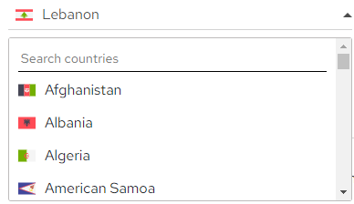
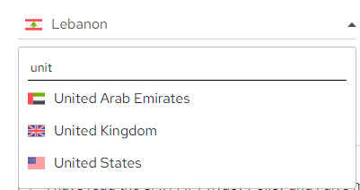

# custom-react-flags

A React library that provides a customizable SVG flags select components and standalone SVG flags components.

## Screenshots:





## Installation

```
yarn add custom-react-flags
npm install custom-react-flags --save
```

## Usage

### ReactFlagsSelect

```javascript
import React, { useState } from "react";
import ReactFlagsSelect from "custom-react-flags";

const App = () => {
  const [selected, setSelected] = useState("");

  <ReactFlagsSelect
    selected={selected}
    onSelect={(code) => setSelected(code)}
  />;
};

export default App;
```

### Country Flag

```javascript
import React from "react";
import { Us } from "custom-react-flags";

const Region = () => (
  <div>
    <Us /> United States
  </div>
);

export default Region;
```

### Country Codes

Full list of [Country Codes](https://github.com/ElieHousseini/custom-react-flags-select/blob/main/src/data/countries.ts).

## Props

### selected

`selected` is a required `string` prop that holds the current value of the input.

```javascript
    <ReactFlagsSelect
      ...
      selected={selected}
    />
```

### onSelect

`onSelect` is a required function prop which recieves the user selected countryCode which should be used to update the selected value.

```javascript
    <ReactFlagsSelect
      ...
      onSelect={code => setSelected(code)}
    />
```

### placeholder

`placeholder` is an optional `string` prop used replace the default placeholder text for the select input.

```javascript
<ReactFlagsSelect
  countries={["US", "GB", "FR", "DE", "IT"]}
  customLabels={{ US: "EN-US", GB: "EN-GB", FR: "FR", DE: "DE", IT: "IT" }}
  placeholder="Select Language"
/>
```

### searchable

`searchable` is an optional `boolean` prop used which add the option to search through the options list. The default value is `false`.

```javascript
    <ReactFlagsSelect
      ...
      searchable
    />
```

### searchPlaceholder

`searchPlaceholder` is an optional `string` prop used replace the default placeholder text for the search input.

```javascript
    <ReactFlagsSelect
      ...
      searchPlaceholder="Search countries"
    />
```

### countries

`countries` is an optional `array` of `string` used replace the default full list of countries. Only countries included in the full list are valid.

```javascript
    <ReactFlagsSelect
      ...
      countries={["US", "GB", "FR", "DE", "IT", "NG"]}
    />
```

### blacklistCountries

`blacklistCountries` is an optional `boolean` prop used to indicate the `countries` prop should be used as a blacklisted, hence these countries will be excluded in the options. The defaut value is `false`.

```javascript
    <ReactFlagsSelect
      ...
      countries={["US", "GB", "FR", "DE", "IT", "NG"]}
      blacklistCountries
    />
```

### customLabels

`customLabels` is an optional `object` prop used to define custom labels. The default country name for a country code will be used when the country code has no label passed.

```javascript
    <ReactFlagsSelect
      ...
      customLabels={{"US": "EN-US","GB": "EN-GB","FR": "FR","DE": "DE","IT": "IT"}} />
    />
```

`customLabels` now also accepts an array of objects (`CustomLabel`) instead of an array of strings. The default country name will still be shown if no label is passed. Also the secondary label will only be shown if there is one present.

```javascript
    <ReactFlagsSelect
      ...
      customLabels={{
        "US": { primary: "EN-US", secondary: "+1" },
        "GB": { primary: "EN-GB", secondary: "+44" },
        "FR": { primary: "FR" }
      }}
      />
    />
```

`customLabels` can also be mixed between `CustomLabel` and `string`.

```javascript
    <ReactFlagsSelect
      ...
      customLabels={{
        "US": { primary: "EN-US", secondary: "+1" },
        "GB": { primary: "EN-GB", secondary: "+44" },
        "FR": "FR"
      }}
      />
    />
```

### showSelectedLabel

`showSelectedLabel` is a an optional `boolean` prop used to show or hide the label text of a selected country. The default value is `true`.

```javascript
    <ReactFlagsSelect
      ...
      showSelectedLabel={false}
    />
```

### showSecondarySelectedLabel

`showSecondarySelectedLabel` is an optional `boolean` prop used to show or hide the secondary label text of a selected country. The default value is `true`.

```javascript
    <ReactFlagsSelect
      ...
      showSecondarySelectedLabel={false}
    />
```

### showOptionLabel

`showOptionLabel` is a an optional `boolean` prop used to show or hide the label text of a countries in the options dropdown. The default value is `true`.

```javascript
    <ReactFlagsSelect
      ...
      showOptionLabel={false}
    />
```

### showSecondaryOptionLabel

`showSecondaryOptionLabel` is a an optional `boolean` prop used to show or hide the secondary label text of a countries in the options dropdown. The default value is `true`.

```javascript
    <ReactFlagsSelect
      ...
      showSecondaryOptionLabel={false}
    />
```

### selectedSize

`selectedSize` is an optional `number` prop used to set the size in pixels of the selected label and the corresponding flag.

```javascript
    <ReactFlagsSelect
      ...
      selectedSize={14}
    />
```

### optionsSize

`optionsSize` is an optional `number` prop used to set the size in pixels of the options labels and the corresponding flags.

```javascript
    <ReactFlagsSelect
      ...
      optionsSize={14}
    />
```

### className

`className` is an optional `string` prop used to pass a `className` to the top container of the Select component.

```javascript
    <ReactFlagsSelect
      ...
      className="menu-flags"
    />
```

### selectButtonClassName

`selectButtonClassName` is an optional `string` prop used to pass a `className` to the select button.

```javascript
    <ReactFlagsSelect
      ...
      selectButtonClassName="menu-flags-button"
    />
```

### fullWidth

`fullWidth` is an optional `boolean` prop used to decide if the Select component should render as a block element or inline element. The default value is `true` which is a block element.

```javascript
    <ReactFlagsSelect
      ...
      fullWidth={false}
    />
```

### alignOptionsToRight

`alignOptionsToRight` is an optional `boolean` prop useful when `fullWidth` is `false` to set the options alignment to right. The default value is `false`.

```javascript
    <ReactFlagsSelect
      ...
      alignOptionsToRight
    />
```

### disabled

`disabled` is a `boolean` prop used to disable to the Select component. The default value is `false`.

```javascript
    <ReactFlagsSelect
      ...
      disabled
    />
```

### id

`id` is a `string` prop used to set the id of the top container of the Select component.

```javascript
    <ReactFlagsSelect
      ...
      id="flags-select"
    />
```

## Flags

Each country flag can be rendered as a SVG component. The components are named by countries Iso2 codes in pascal case.

```javascript
<GB />
```

The SVG `viewBox` is preserved and SVG inherits it's parent element's text size.

## Contribution

This project is written in Typescript and developed with [Storybook](https://storybook.js.org/). Tests are written with Jest and [React Testing Library](https://testing-library.com/docs/react-testing-library/intro/). Raise a pull request with your changes.

#### Installation

```
yarn install
```

#### Start Storybook

Builds SVG components to `src/components/Flags/Countries/

```
yarn start
```

## v1 Documentation

[React Flags Select v1](https://github.com/ElieHousseini/custom-react-flags-select/blob/main/v1.md)

## License

This project is distributed under the MIT license.
